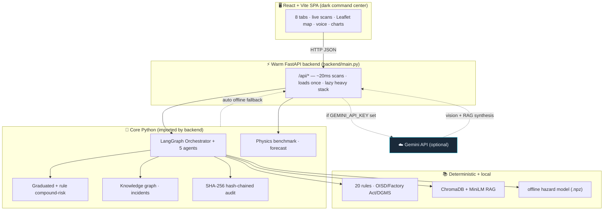
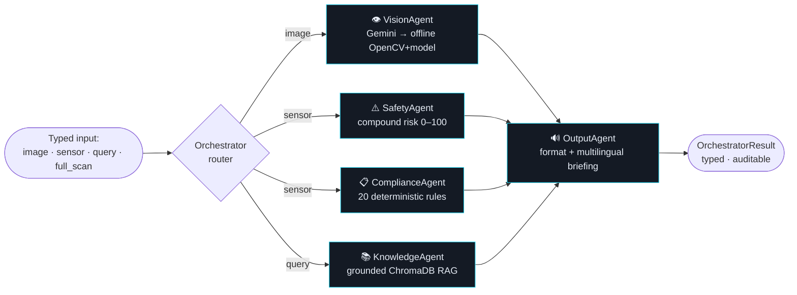
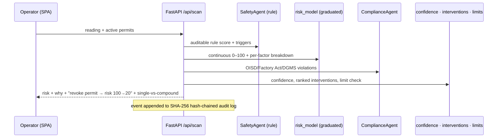
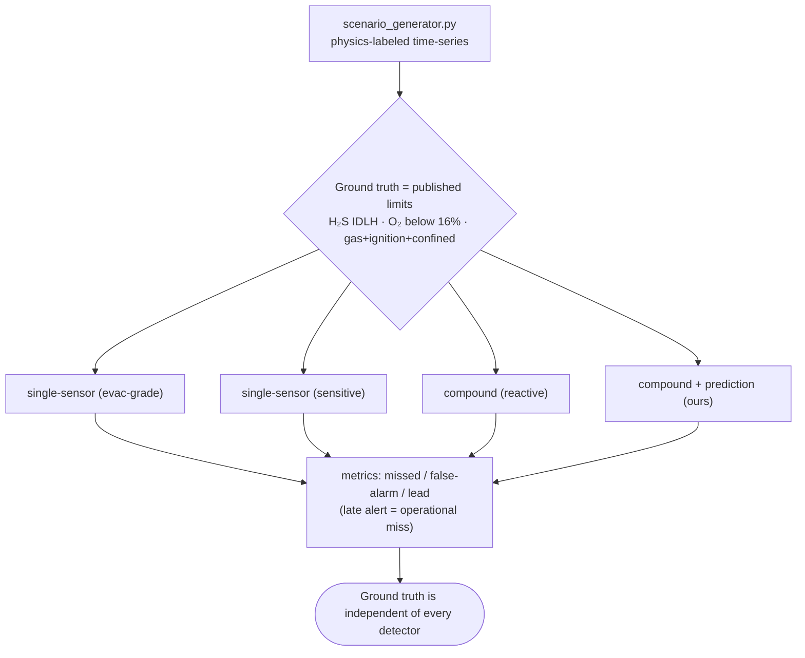

<div align="center">

# 🛡️ IndustrialSafetyAI

### Agentic Compound-Risk Intelligence for Zero-Harm Industrial Operations

*Fuse gas sensors, permits, CCTV and shift logs into one predictive layer that detects the dangerous **combinations** no single sensor sees — and acts before a fatality, not after.*


</div>

---

## 📌 The problem

> India's DGFASLI recorded **6,500+ fatal workplace accidents in FY2023**. In January 2025, **eight workers died** at the Visakhapatnam Steel Plant coke-oven when entrapped gases exploded — a facility that *had* working gas detectors, permits and SCADA. The warning signals existed; **nothing connected them in time.**

The gap is not sensors. It is the missing **intelligence layer** that fuses disparate signals into a real-time, predictive risk picture and acts on it. IndustrialSafetyAI is that layer.

---

## 🎯 The headline result — the metric that saves lives

PS1's decisive metric is *"reduction in false-negative rate."* We measure it honestly on a **physics-labeled** benchmark with **detector-independent ground truth** (`tools/benchmark.py`, stable across random seeds):

| Detector | Missed incidents (operational) | False alarms | Median early warning |
| :-- | :--: | :--: | :--: |
| Single-sensor · evacuation-grade alarms | **21 / 26** (blind to conjunctions) | ~0% | — |
| Single-sensor · sensitive alarms | 0 / 26 | **100%** (alarm fatigue) | 31 min |
| **Compound + prediction (ours)** | **0 / 26** | **~0–3%** | **~18–19 min** |

> Single sensors force an impossible trade-off — go **blind** to sub-threshold conjunctions, *or* **drown** operators in false alarms. Our engine fuses **gas + permit + confinement + maintenance + shift-changeover + trend** to escape it: it catches every incident on the benchmark, early, without crying wolf.
>
> *Counts are on the synthetic benchmark; real-world rates depend on sensor coverage and are non-zero — the point is the large, defensible gap vs single-sensor baselines.*

---

## 🏗️ System architecture



**Two-tier, hybrid, offline-first.** The React SPA is served by the FastAPI backend at a
single URL. Gemini adds cloud-grade vision + grounded RAG **when a key is present**; on
any absence, failure, or rate-limit the system **falls back to the fully-offline path
automatically** — the pitch is *"cloud-accurate when connected, functional when air-gapped."*
*(A legacy all-in-one Streamlit app also ships in `ui/app.py`.)*

---

## 🔄 The 5-agent LangGraph pipeline



Contract-first: every agent takes a typed `*Input` dataclass and returns its `*Result`
dataclass from the **immutable** `schema.py`. Nodes return update dicts only; a single
failing agent never crashes the run.

---

## ⚙️ A live compound-risk scan



---

## 🧪 How the benchmark proves it (no test-gaming)



---

## 🚀 Key capabilities

| Area | What it does |
| :-- | :-- |
| **Compound risk** | Graduated continuous 0–100 with per-factor breakdown (live) **+** an auditable rule engine (benchmark); maintenance & shift-changeover escalations. |
| **Prediction** | Trajectory forecasting → minutes-to-threshold; live predictive stream. |
| **Counterfactual** | Ranks the single action (revoke permit / ventilate / purge) that most reduces risk, with before/after scores. |
| **Vision** | Gemini multi-hazard scene understanding online; **custom-trained PyTorch ML Head on 768-dim Vision Transformer (ViT) embeddings** offline (zero label string-matching). |
| **Agentic Action**| True LangChain ReAct loop equipped with multi-tool calling (RAG manual + TSDB history + MQTT) to autonomously investigate and confirm hazards before shutdown. |
| **Edge Persistence**| SQLite Time-Series Database (TSDB) for high-throughput IoT sensor ingestion and sliding-window forecasting, surviving server crashes. |
| **Compliance** | 20 deterministic rules, each cross-referenced to **OISD + Factory Act 1948 + DGMS**. |
| **Grounded RAG** | ChromaDB + MiniLM over OISD/Factory Act/DGMS; Gemini synthesis online, sentence-ranked extractive offline; cited, honest. |
| **Knowledge graph** | Permit-proximity intelligence — flags ignition/intrusive permits in/adjacent to elevated-gas zones. |
| **Incident intelligence** | Mines a near-miss corpus for recurring prevention priorities + similar-incident retrieval. |
| **Confidence** | Coverage · decisiveness · freshness — how much to trust each verdict. |
| **Emergency** | Multilingual (10 languages) spoken evacuation + briefing; robust browser TTS with offline fallback. |
| **Audit** | Tamper-evident SHA-256 hash-chained evidence log + one-click integrity check. |
| **Geospatial** | Real Leaflet plant map (auto-locate, risk zones, facilities) + weighted heatmap + graph. |
| **Industrial hygiene** | PEL/STEL, %LEL, ventilation CFM, purge time, evacuation radius. |
| **Offline-first** | Local CV + cached embeddings + deterministic engines → works air-gapped. |

---

## 🧰 Tech stack

| Layer | Stack |
| :-- | :-- |
| Frontend | React 18 · Vite · Leaflet · Web-Speech TTS (deps kept minimal) |
| Backend | FastAPI · Uvicorn · Pydantic (warm, lazy-loaded heavy stack) |
| Database | **SQLite3 Edge TSDB** (Zone telemetry & sliding-window history) |
| Agents | LangGraph `StateGraph` · **LangChain ReAct Multi-Tool Agent** |
| ML / CV | **HuggingFace ViT pooler embeddings** · Custom PyTorch MLP · OpenCV · sentence-transformers (MiniLM) |
| RAG | ChromaDB (persistent) · `all-MiniLM-L6-v2` |
| Cloud (optional) | Google Gemini (`gemini-2.5-flash` …) — vision + grounded synthesis |
| Quality | 139 pytest · 16 authoritative acceptance tasks · headless UI tests |

---

## ⚡ Quick start

```powershell
# Windows PowerShell
cd $env:USERPROFILE\Desktop\v
# Windows: always set UTF-8; offline embeddings avoid HF hub hangs
$env:PYTHONUTF8=1; $env:PYTHONIOENCODING="utf-8"; $env:HF_HUB_OFFLINE=1; $env:TRANSFORMERS_OFFLINE=1

# 1) build the React command center (once)
cd frontend; npm install; npm run build; cd ..

# 2) run the warm backend — it serves BOTH the UI and the API
.\venv\Scripts\python.exe -m uvicorn backend.main:app --port 8000
#    → open http://localhost:8000   (API at /api/*, docs at /docs)
```
```bash
# Mac/Linux bash
cd ~/Desktop/v
export PYTHONUTF8=1 PYTHONIOENCODING="utf-8" HF_HUB_OFFLINE=1 TRANSFORMERS_OFFLINE=1

# 1) build the React command center (once)
cd frontend && npm install && npm run build && cd ..

# 2) run the warm backend — it serves BOTH the UI and the API
./venv/bin/python -m uvicorn backend.main:app --port 8000
#    → open http://localhost:8000   (API at /api/*, docs at /docs)
```

**Optional cloud accuracy:** put `GEMINI_API_KEY=...` in `.env` (gitignored — never
committed). Vision → real Gemini scene understanding; Knowledge → grounded synthesis.
Without it, everything runs **fully offline**.

**Alternatives:** `python -m streamlit run ui\app.py --server.port 8502` (all-in-one) ·
`python -m tools.judge_demo` (offline narrated demo, no browser).

---

## 🔌 Backend API (selected)

`GET /api/health` · `POST /api/scan` · `GET /api/zones` · `POST /api/forecast` ·
`GET /api/incidents` · `GET /api/benchmark` · `GET /api/audit/verify` ·
`POST /api/knowledge` · `POST /api/vision` · `GET /api/exposure` · `POST /api/dispatch` ·
`POST /api/briefing` · `GET /api/facilities` — full interactive docs at **`/docs`**.

---

## 🧭 The command center (8 tabs)

**Dashboard** (live risk + breakdown + compound-vs-single + confidence + interventions +
limits + predictive stream) · **Zone Map** (Leaflet + heatmap + permit-proximity graph) ·
**Vision** (upload/camera + Gemini/offline badge) · **Knowledge** (RAG chat, saved to
device) · **Emergency** (multilingual voice dispatch + briefing) · **Safety Tools**
(exposure calculator + facilities) · **Intelligence** (agent pipeline + incident patterns
+ tamper-evident audit) · **Benchmark** (methodology + honest results).

---

## ✅ Testing

```powershell
# Windows PowerShell
python -m pytest -q                                             # ~139 tests, offline-deterministic
for($i=1;$i -le 16;$i++){ python tools\accept.py ("T{0:D3}" -f $i) }   # 16 acceptance tasks
python -m tools.benchmark                                       # the compound-vs-single benchmark
python tools\ui_apptest.py                                      # headless Streamlit UI
```
```bash
# Mac/Linux bash
./venv/bin/python -m pytest -q
for i in {1..16}; do ./venv/bin/python tools/accept.py "T$(printf "%03d" $i)"; done
./venv/bin/python -m tools.benchmark
./venv/bin/python tools/ui_apptest.py
```

All checks pass. Tests require no network.

---

## 🗂️ Project structure

```
backend/        FastAPI app (serves React + /api/*)
frontend/       React/Vite SPA (src/{App,tabs,api,lib,voice,i18n})
agents/         orchestrator + vision/safety/compliance/knowledge/output
utils/          risk_model · scenario_generator · baseline_detector · forecast ·
                knowledge_graph · incident_intelligence · confidence · interventions ·
                limit_check · local_vision · gemini_vision · audit_logger · translations …
models/         train_hazard_model.py → hazard_model.npz (offline fire model)
knowledge_base/ build_db.py + raw/safety_standards.md + incidents.json
compliance/     safety_rules.json (20 rules · tri-framework refs)
tools/          benchmark · judge_demo · accept · ui_apptest
tests/          ~139 pytest
schema.py       IMMUTABLE dataclass contract        CLAUDE.md   engineering contract
docs/           pitch deck + demo script            HANDOFF.md  full continuation brief
ui/             legacy Streamlit app (port 8502)
```

---

## 🏆 PS1 evaluation coverage

| Focus area | How we address it |
| :-- | :-- |
| Compound accuracy vs single-sensor | Physics-labeled benchmark, detector-independent ground truth |
| Prediction lead time | Trajectory forecasting + live stream (~18 min median lead) |
| Geospatial quality | Real Leaflet map + heatmap + permit-proximity knowledge graph |
| Regulatory coverage | 20 rules × **OISD + Factory Act 1948 + DGMS** |
| False-negative reduction | The headline benchmark result (large, honest gap) |

---

## 📞 Emergency reference

`112` National Emergency · `101` Fire · `108` Ambulance · `1906` Gas-leak / PESO · `1078` NDMA — all 24×7.

<div align="center">

*Built for high-stakes industrial environments where a wrong answer costs lives.*
**New here? Read [`HANDOFF.md`](HANDOFF.md) and [`CLAUDE.md`](CLAUDE.md) first.**

</div>
